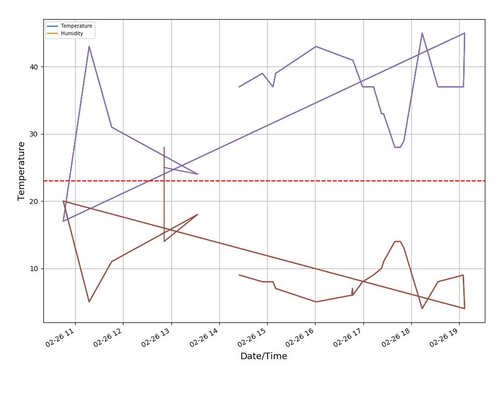

# Monitor Temperature Remotely with Webapp on Raspberry Pi


## 1. Get the computer parts
You  need: 
 - Raspberry pi 3,4 or Zero (or another model is fine as long as you have wifi). 
 - DHT 11 sensor
 - (Optional) An LED display
 - (Optional) A 240V relay

 **Where to get them**
If you are in the UK you can be lazy and use this [amazon shopping cart](http://amzn.eu/7rWGZtP) but I find [RS Components](https://uk.rs-online.com) to be the fastest and cheapest (free next day delivery and no minimum order). They stock older raspi versions (3+) which are perfect for this project as well as almost infinite amount of sensors and other electronics. 


## 2. Setup 

This project will require controlling GPIO pins on the Raspberry Pi. The layout of these pins is almost impossible to remember or understand. I recommend this outstanding resource: 
**[Pi GPIO layout](https://pinout.xyz/pinout/pin3_gpio2)**

I will refer exclusively to the actual pin numbers on the device: 1-40

**Running the DHT 11**

DHT11 is great because it is a 3 pin device, just like a relay you have a 5V, GND and comm (receive). 

| DHT11  |  Raspi |
|---|---|
| Vcc |  4 |
| GND |  6 |
| Com |  7 |


**( Optional) Running an LED display**

Basically just this [blog](https://raspi.tv/2015/how-to-drive-a-7-segment-display-directly-on-raspberry-pi-in-python).

## 3. The Code

Assuming you have downloaded a fresh rasbian Buster Lite install (from [here](https://www.raspberrypi.org/downloads/raspbian/)) and have followed the instructions to [flash an sd card](https://www.raspberrypi.org/documentation/installation/installing-images/) and booted your raspi (zero, 3, or 4). 

Enable SSH and setup your wifi details:

`sudo raspi-config`

follow the instructions on `interfacing options` and enable SSH. Set your wifi SSID and passphrase and exit by clicking finish. 

at the cmd line type
`sudo apt update && sudo apt upgrade -y`
 
Install git

`sudo apt install git`

Add nessecary python packages

`sudo apt-get install build-essential python-dev`

Install `numpy` and `matplotlib`:

`sudo apt-get install python-numpy python-matplotlib python-pandas`

Copy this respoitory! 

`git clone https://github.com/tmopencell/labtemplogger.git`

`cd labtemplogger`

Get add on for Adafruit DHT:

`git clone https://github.com/adafruit/Adafruit_Python_DHT.git`

`cd Adafruit_Python_DHT`

`sudo python setup.py install`

`cd ..`

`sudo rm -r Adafruit_Python_DHT`

Install the webserver and set it up to direct to our output file folder:

`sudo apt install nginx`

Edit the nginx file to point to this page:

`sudo nano  /etc/nginx/sites-available/default`

edit to point to: `root /home/pi/labtemplogger/www`

`sudo service nginx restart`

Collect your IP address using this command (they look like this: 192.168.0.102)

`ifconfig`

Write down your IP address (in the wlan section next to inet). Edit the `www/` folder with the `index.html` to make sure to update the `<IP address>` to your IP:

`sudo nano www/index.html`

In this file edit to include your IP Address: 

```
<html>
<head>
<title> Lab temperature logger</title>
</head>
<body>
<center>
<h1>Lab Temperature Logger</h1>

<a href="http://<YOUR IP ADDRESS>/temphum_graph.png">
/temphum_graph.png" alt="Temperature-Humidity-Graph".</a>

<h3><a href="temphum-record.csv" download>Download Data</a></h3>


<h3>Issues? Check https://github.com/tmopencell/labtemplogger</h3>

</center>
</body>
</html>
```

Now if run the script with 

`python set_temp.py` 

you will enter your desired temperature and begin to see the data on temperature and humidity! If you head over to `<YOUR IP ADDRESS>` in a web browser and you should see your page rendered! 

<html>
<head>
<title> Lab temperature logger</title>
</head>
<body>
<center>
<h1>Lab Temperature Logger</h1>

<a href="www/temphum_graph.png">


<h3><a href="www/temphum-record.csv" download>Download Data</a></h3>


<h3>Issues? Check https://github.com/tmopencell/labtemplogger</h3>

</center>
</body>
</html>

finally if you want to run the script in the background:

`sudo apt install screens`

running as a background process:

`nohup python set_temp.py &`

This puts your file in the background and pipes any output to `nohup.out`. 

If you then type:

`screen`

you will be able to close the terminal and your logger will continue running!  


